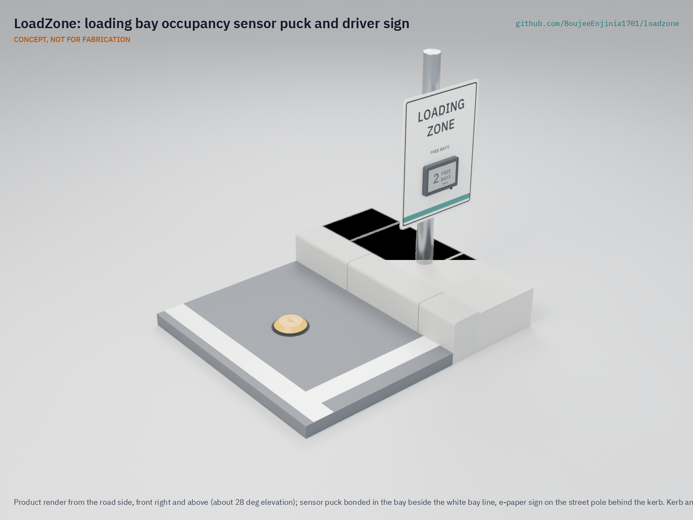

# LoadZone

  

**Area:** Smart Cities · **TRL:** 3 of 9 (proof of concept on paper) · **Prototype budget:** about $120 USD · **Difficulty:** 2 of 5

A curbside loading bay occupancy sensor that shows delivery drivers which bays are free and gives cities data on curb use.

[Exploded render](media/render-exploded.png) · [Detail render](media/render-detail.png) · [Interactive 3D model](media/viewer.html) · [Concept blueprint (PDF)](media/concept-blueprint.pdf) · [General arrangement (PDF)](cad/drawings/LDZ-DWG-001.pdf) · [Sizing calculations](docs/04-calcs/01-sizing.md) · [Review note](docs/REVIEW.md)

## Concept rationale

Knowing bay availability reduces circling and double parking. LoadZone puts a low, battery-powered puck in the middle of each vehicle slot of a loading bay. A magnetometer senses the steel body of a parked vehicle, and a LoRaWAN radio from the lab's FieldNode core reports "free" or "occupied" in about 18 s (39 s at worst). A server turns these reports into live bay state for drivers, and occupancy and dwell times for the city; a solar e-paper sign on an existing pole is an option.

It is open and garage-buildable because curb data should belong to the street, not to a vendor. A magnetometer cannot see faces or number plates, so privacy holds even if the firmware is changed, and anyone can inspect how a "free" or "occupied" call is made. The puck is a cast dome over potted off-the-shelf parts, bonded to the road like a raised pavement marker, and the data can be published in the open Curb Data Specification format so cities can compare it with carrier data.

## Burning platform

Loading bays are full, and often not with deliveries. In a study of downtown Seattle, passenger vehicles were 52 % of all vehicles parked in commercial load zones, and 41 % of commercial vehicles parked in unauthorized locations, rising to 55 to 65 % near retail centers ([Urban Freight Lab, 2019](https://urbanfreightlab.com/publications/the-final-50-feet-of-the-urban-goods-delivery-system-tracking-curb-use-in-seattle/)). The same group reports that commercial load zones often run at 90 % occupancy or more during business hours ([Urban Freight Lab](https://urbanfreightlab.com/final-50-feet/)). A driver who finds the bay taken stops in the traffic lane or the bike lane.

Pressure on the curb keeps rising. Online sales rose from 16 % to 19 % of all retail sales in 2020 ([UNCTAD, 2021](https://unctad.org/news/global-e-commerce-jumps-267-trillion-covid-19-boosts-online-sales)), and in Great Britain van traffic grew 2.3 % to 59.0 billion vehicle miles in the year to September 2024 ([Department for Transport](https://www.gov.uk/government/statistics/provisional-road-traffic-estimates-great-britain-october-2023-to-september-2024)). Cities cannot manage bays they cannot measure, and most loading bays today are measured only by occasional manual surveys.

## Where it could be used

### By industry

| Industry | Use |
| --- | --- |
| Municipal transport and curb management | Occupancy, turnover and dwell time by bay and hour, to size bays and set hours and pricing |
| Parcel, food and freight carriers | Route drivers to a free bay; fewer double-parked stops and tickets |
| Retail streets and business districts | Shared loading bays for shop suppliers, with evidence for more or better-placed bays |
| Parking enforcement | Find overstays in loading bays without patrols or cameras |
| Hospitals, campuses and industrial sites | Manage private loading bays and short-stay drop-off areas |
| Research and education | Open, reproducible curb-use data for transport studies |

### By country or region

| Country or region | Why it matters there |
| --- | --- |
| United States | In downtown Seattle, 41 % of commercial vehicles parked in unauthorized locations ([Urban Freight Lab, 2019](https://urbanfreightlab.com/publications/the-final-50-feet-of-the-urban-goods-delivery-system-tracking-curb-use-in-seattle/)); cities are now comparing curb programs through US DOT SMART grants ([Urban Freight Lab](https://urbanfreightlab.com/research-projects/open-mobility-foundation-smart-grant-curb-collaborative/)) |
| United Kingdom | Van traffic grew 2.3 % to 59.0 billion vehicle miles in the year to September 2024 ([Department for Transport](https://www.gov.uk/government/statistics/provisional-road-traffic-estimates-great-britain-october-2023-to-september-2024)) |
| European Union | Data protection by design is a legal duty ([Regulation (EU) 2016/679, Article 25](https://eur-lex.europa.eu/legal-content/EN/TXT/HTML/?uri=CELEX:32016R0679)), which favors curb sensors that cannot capture personal data at all |
| South Korea | Online sales reached 25.9 % of retail in 2020, the highest share UNCTAD reported ([UNCTAD, 2021](https://unctad.org/news/global-e-commerce-jumps-267-trillion-covid-19-boosts-online-sales)), so dense cities carry heavy parcel traffic |
| India | National guidelines for City Logistics Plans ask cities to optimize loading and unloading lots and to track the daily use of each bay and the number of deliveries it serves ([DPIIT, Guidelines for Preparing City Logistics Plan](https://www.dpiit.gov.in/static/uploads/2025/07/4e218c186c4bdbc202d9f1f62bb9b372.pdf)); a low-cost open sensor can supply that count without cameras |
| Brazil | São Paulo's traffic agency lists 1,749 on-street truck bays reserved for loading and unloading, paid by digital card for one or two hours ([CET São Paulo](https://www.cetsp.com.br/consultas/zona-azul/vagas-especiais/vagas-caminhao.aspx)); sensing could show drivers which are free and show the city how long each stop lasts |

## What sparked the idea

The starting point was San Francisco's SFpark pilot, which set magnetometer "pucks" into metered parking spaces to publish real-time availability. The agency's own sensor data guide records where that approach fell short: the in-ground sensors, 4 in (about 100 mm) across, had batteries intended to last about five years, cut to about three by noise-filtering software, yet some began to fail in late 2012 and early 2013, about a year earlier than expected, and users were advised to aggregate the data by hour and by block to reduce the effect of sensor error ([SFMTA, Parking Sensor Data Guide, 2013](https://www.sfmta.com/sites/default/files/reports-and-documents/2018/08/sfpark_dataguide_parkingsensordata.pdf)). LoadZone takes the same sensing principle to the loading bay, where stops last minutes rather than hours, and answers those lessons in the open: a surface-bonded puck that needs no coring, a cell budget derated 40 % against the five-year target, and firmware and data that a city can inspect rather than rent.

## Problem

Delivery vehicles double-park when loading bays are occupied or unknown, blocking lanes and bike paths. Drivers cannot see whether a bay is free before they reach it, and cities have no routine record of how their loading bays are used. See the [problem statement](docs/01-problem.md).

## Concept

A curbside loading bay occupancy sensor that shows delivery drivers which bays are free and gives cities data on curb use.

Full design precis: [docs/02-concept.md](docs/02-concept.md)

## Key components

- Surface-bonded bay sensor puck on a two-part road-marker epoxy bed, 150 mm diameter and 31 mm high, cast polyurethane over potted electronics, one per vehicle slot of about 7 m
- 3-axis magnetometer (LIS2MDL class) for vehicle detection
- FieldNode radio core (STM32WL-class LoRaWAN module) with an internal antenna
- Two AA-size lithium thionyl chloride cells, 7.7 years of life at SF9 (calculated, derated 40 %)
- Open server and data feed that maps onto the Curb Data Specification
- Solar signage option: 7.5 in e-paper sign on an existing pole, powered by a host FieldNode, legible by day; needs a private network server such as TwinKit

TRL 3 calculations ([LDZ-CAL-001](docs/04-calcs/01-sizing.md)): state reported in 17.7 s typically and 38.6 s at worst, 7.7 years on one set of cells, and $114.00 in parts for a two-slot bay against the $120 budget; the sign option ($97.00 plus a $126.00 FieldNode) is costed separately. No requirement is now not met. A puck under a parked van reaches a gateway about 350 m away in a street canyon, so each bay needs a gateway within 300 m (R4), and the e-paper sign is a daylight-only aid, unlit at night (R11). Detection of high-clearance trucks (R1), airtime at slow data rates (R5) and the epoxy road bond under braking (R6) are at risk. See the [design precis](docs/02-concept.md), [requirements](docs/03-requirements.md) and design decisions ([LDZ-DDR-001](docs/decisions/0001-trl2-review-decisions.md), [LDZ-DDR-002](docs/decisions/0002-recommendations-accepted.md)). The parametric model is [cad/src/model.py](cad/src/model.py), with STEP files in `cad/step/`.

The working bill of materials is in [bom/bom.csv](bom/bom.csv).

## Safety

> Street furniture and pole mounts must be installed only with the asset owner's permission, by trained crews, with fall protection and traffic management as local rules require.
>
> Pucks are installed in the roadway: work only under a road permit and traffic management. The pucks contain primary lithium thionyl chloride cells: never recharge, short, crush or heat them. Road-marker adhesives and polyurethane casting resins are hazardous; follow their safety data sheets.

## Repository layout

| Folder | Contents |
| --- | --- |
| `docs/` | Problem, concept, requirements, calculations and design decisions |
| `cad/src/` | build123d Python source, the source of truth for all geometry |
| `cad/step/`, `cad/stl/` | Exported models for FreeCAD, other CAD tools and printing |
| `cad/drawings/` | 2D sketches and dimensioned drawings |
| `bom/` | Bill of materials |
| `electronics/` | KiCad schematics and PCB layouts |
| `firmware/` | Microcontroller code |
| `media/` | Renders, perspectives and photos |
| `build-log/` | Dated prototyping notes |

## Documentation

Controlled documents follow the portfolio [documentation standard](.kit/STANDARDS.md). Each carries a document ID (LDZ-PRC-001 for the precis), a version and a revision history. Branded PDFs are built with `python .kit/render.py` and attached to GitHub Releases when a document is tagged, for example `LDZ-PRC-001/v1.0`.

## Credits

Designed by Amish Chadha. See [CONTRIBUTORS.md](CONTRIBUTORS.md) for roles. To cite this design, use [CITATION.cff](CITATION.cff) (GitHub shows it as "Cite this repository").

AI assistance (Claude) was used to accelerate concept renders, prototype documentation and first-pass sizing calculations. Design direction and all decisions are Amish Chadha's, recorded in this repository's decision records (`docs/decisions/`).

## Licenses

- **Hardware** (CAD, drawings, BOM, electronics): [CERN-OHL-S v2](LICENSE)
- **Software** (firmware, scripts, notebooks): [MIT](LICENSE-SOFTWARE)

A project of the [Design Molecule](https://designmolecule.com) lab.
