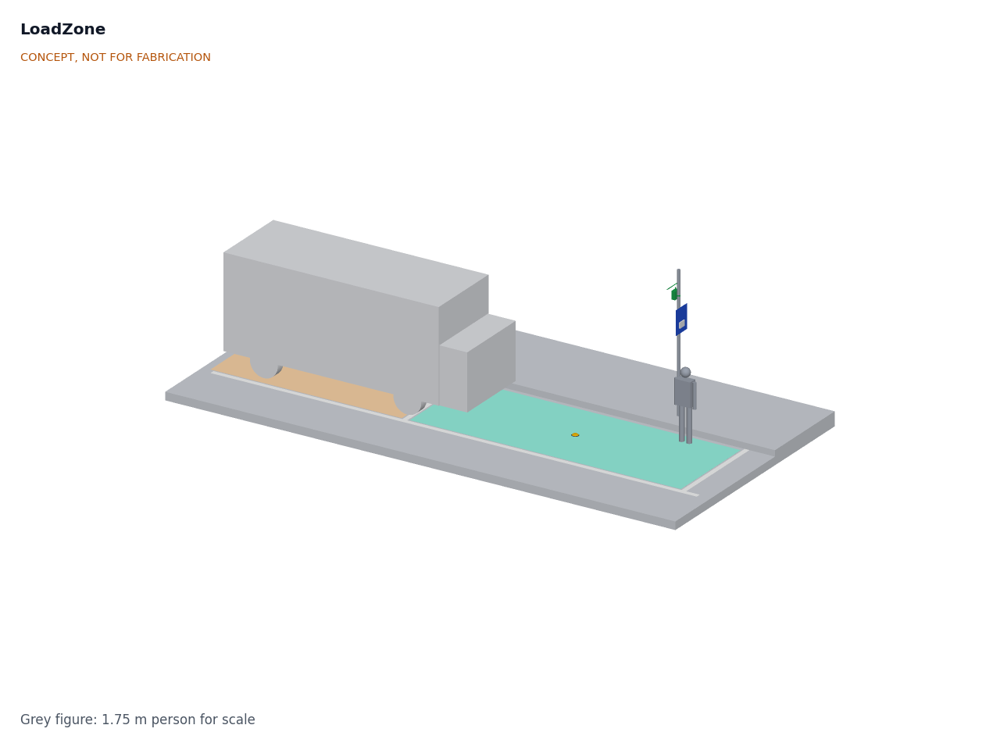
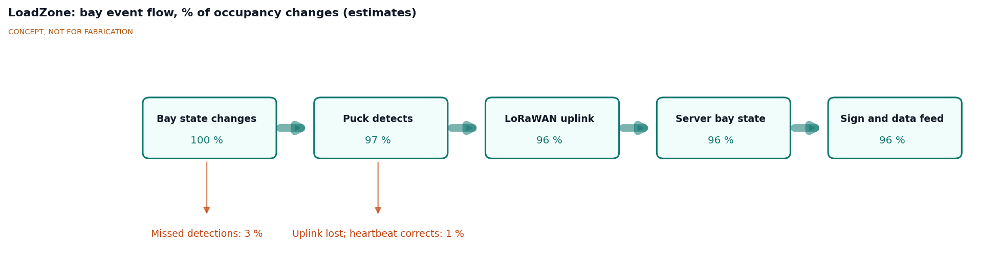
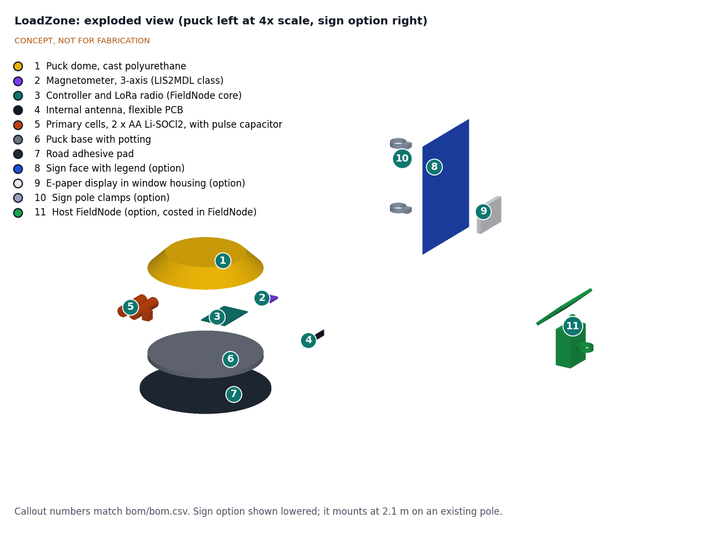
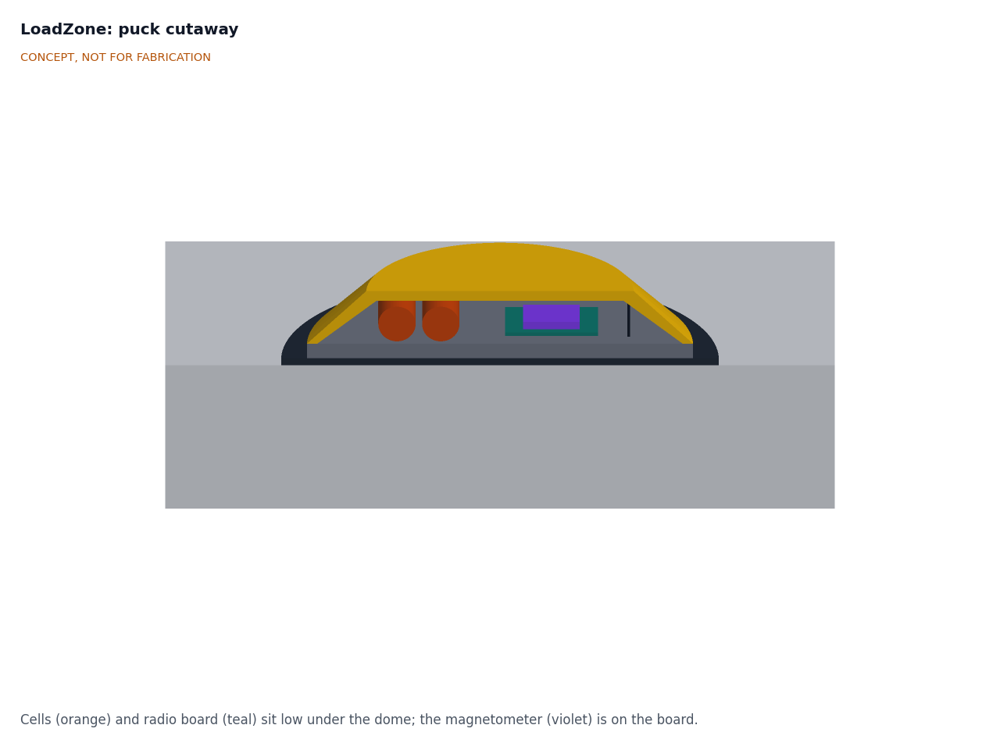

# LoadZone design precis

## Summary

LoadZone is a low, battery-powered puck bonded to the road in the middle of each vehicle slot of a loading bay. A 3-axis magnetometer senses the change in the Earth's magnetic field when a vehicle's steel body parks over it, and a LoRaWAN radio from the lab's FieldNode core reports "free" or "occupied" within about 20 s. A server turns the reports into bay state, dwell times and an open data feed that maps onto the Curb Data Specification, and, as an option, a solar e-paper sign on an existing pole shows approaching drivers how many slots are free. On first-order estimates a puck lasts about 7 years on two AA-size lithium thionyl chloride cells, and a two-slot bay kit costs about $110 in parts. Every choice below is proposed, awaiting Amish.

Figure 1. Concept massing model in a two-slot loading bay: the free slot (teal) with its puck, the occupied slot (orange) under a van, and the optional sign on an existing pole, with a 1.75 m person for scale. CONCEPT, NOT FOR FABRICATION.

## How it works

1. **Sense.** Each puck wakes about once a second and takes a single magnetometer reading. With no vehicle, the reading is the local Earth field plus a fixed offset learned at install. A car or van parked above distorts the field by several microtesla (estimate), mostly in the vertical axis.
2. **Decide.** Firmware compares the field change with an adaptive threshold and requires the new state to hold for about 15 s before accepting it, so traffic passing in the next lane and vehicles pausing briefly do not count. The baseline is re-learned slowly while the slot is free, to follow temperature drift and road works nearby.
3. **Report.** On each confirmed change, and hourly as a heartbeat, the puck sends a LoRaWAN uplink of about 12 bytes: slot state, time since the last change, a confidence value, cell voltage and temperature. No raw magnetic data leave the device by default.
4. **Aggregate.** A LoRaWAN network server (TwinKit, The Things Network or a city network) passes uplinks to a small open service that keeps bay state, computes occupancy and dwell time, and publishes them in a form that maps onto the Curb Data Specification Events and Metrics APIs ([Open Mobility Foundation](https://www.openmobilityfoundation.org/about-cds/)).
5. **Show (option).** A FieldNode on a nearby pole, running as a LoRaWAN class C device, receives a short downlink when the bay state changes and redraws a 7.5 in e-paper panel set into a "Loading zone" sign: the number of free slots and an arrow. The same state can appear in carriers' routing tools and city maps through the data feed.

Figure 2. Bay event flow, in percent of real occupancy changes (estimates, to be measured in a field trial).

## Main components

Table 1. Components (numbers match `bom/bom.csv` and Figure 3)

| No. | Component | Concept choice |
| --- | --- | --- |
| 1 | Puck dome | Cast polyurethane, high-visibility yellow, 150 mm base diameter, 31 mm total height, radio-transparent |
| 2 | Magnetometer | 3-axis, 16-bit, LIS2MDL class, on a small breakout ([STMicroelectronics](https://www.st.com/en/mems-and-sensors/lis2mdl.html)) |
| 3 | Controller and radio | STM32WL-class LoRaWAN module on a small carrier, the same core as FieldNode |
| 4 | Antenna | Flexible PCB antenna for 868 or 915 MHz, fixed inside the dome wall, above the cells |
| 5 | Cells | Two AA-size Li-SOCl2 bobbin cells (about 2.6 Ah each, typical rating) with a pulse capacitor to supply transmit current |
| 6 | Base and potting | Flat base disc; electronics potted in polyurethane with a desiccant pocket |
| 7 | Road adhesive pad | Bitumen pad or two-part road-marker epoxy, as used for raised pavement markers |
| 8 | Sign face (option) | Aluminium composite panel, 450 x 600 mm, "Loading zone" legend and a window for the display |
| 9 | Display (option) | 7.5 in e-paper panel with driver board, behind a polycarbonate window in a sealed housing |
| 10 | Sign clamps (option) | Two stainless band clamps with brackets for 60 to 90 mm poles |
| 11 | Host FieldNode (option) | Standard FieldNode (6 W panel, LiFePO4 cell, LoRaWAN), mounted above the sign and costed in the FieldNode repo |

Figure 3. Exploded view; callout numbers match `bom/bom.csv`. The puck is drawn at 4x scale.

Figure 4. Puck cutaway: cells (orange) and the radio board (teal) with the magnetometer (violet) sit low under the dome, and the antenna stands at the dome's edge.

## First-order numbers

All values are estimates for review and will be checked at TRL 3.

Table 2. Puck energy budget

| Quantity | Estimate | Assumption |
| --- | --- | --- |
| Sleep current | about 6 µA | Module in stop mode, magnetometer idle, leakage |
| Sampling | about 20 µA average | One reading a second; about 10 ms awake at about 2 mA |
| Uplinks | about 0.55 mAh/day | 100 state changes and 24 heartbeats, about 16 mA·s each at SF9 (FieldNode estimate) |
| Total | about 1.2 mAh/day, 0.43 Ah/year | Sum of the above |
| Usable cell capacity | about 3.1 Ah | 2 x 2.6 Ah, derated 40 % for cold, pulse loads and self-discharge |
| Cell life | about 7 years | 3.1 Ah / 0.43 Ah per year; R3 asks for 5 years |

**Airtime.** A 12-byte uplink is on air for about 72 ms at SF7 and about 247 ms at SF9 (FieldNode's figures for a slightly longer payload). At 124 uplinks a day that is about 9 s at SF7 and about 31 s at SF9, against The Things Network's 30 s fair-use limit ([TTN](https://www.thethingsnetwork.org/docs/lorawan/duty-cycle/)). Pucks that need SF9 or slower must send heartbeats every 2 h, which brings SF9 to about 28 s.

**Detection.** The Earth's field is roughly 25 to 65 µT depending on location, well within the sensor's ±50 gauss (±5,000 µT) range. The vehicle signal is expected to be a few microtesla to a few tens of microtesla at a clearance of 0.2 to 0.5 m (estimate). The sensor's resolution is far finer than this, so the limits are drift, nearby traffic and vehicles with high ground clearance, not sensitivity. R1 is therefore unverified until field data exist.

**Link.** A puck at road level, with a van above it, may lose 10 to 20 dB compared with an open-sky node (estimate). With FieldNode's link budget of about 145 dB at SF9, that still leaves room for a gateway on a rooftop a few hundred meters away, but range in a street canyon is unverified (R4).

**Load.** A 50 kN wheel load spread over a 150 mm puck is about 2.8 MPa if the tire bears on the whole top, and more at the dome's crown (estimate). Cast polyurethane over potted electronics behaves like a raised pavement marker; a printed housing would not be expected to survive (R6 not met).

**Sign.** Class C listening costs about 15 mW, or 0.36 Wh a day, and about 200 e-paper redraws a day add about 0.03 Wh (estimates). The total of about 0.4 Wh a day is well within FieldNode's sensor allowance of about 2.75 Wh a day. A 7.5 in panel gives digits of about 80 mm, legible at about 10 m in daylight (estimate), short of R11's 25 m target, and the panel is unlit at night.

**Mass and size.** Puck about 0.35 kg (estimate), 150 mm diameter, 31 mm high.

**Cost.** About $110 in parts for a two-slot kit, within the $120 budget. The sign option adds about $97 plus a host FieldNode of about $126 (see `bom/bom.csv`).

## Key design choices (all proposed, awaiting Amish)

1. **Surface-bonded puck rather than an in-ground (cored) sensor.** No road works for a pilot and easy removal. In-ground units are better protected from plows and theft, so a cored variant stays open for deployments.
2. **Magnetometer only, rather than magnetometer plus radar.** Lowest cost and power. A small radar looking up through the dome could confirm detections; it stays an open option if R1 is not met in trials.
3. **One puck per vehicle slot of about 7 m**, rather than one per bay. Bays hold one to three vans; slot-level state lets the sign say "1 free" rather than "space somewhere".
4. **Primary Li-SOCl2 cells rather than rechargeable cells with a solar cell on the puck.** A road-level solar cell is shaded by parked vehicles and soiled by tires. Two AA cells give margin over the 5-year target.
5. **LoRaWAN with the FieldNode core.** Shared firmware, tools and gateways across the lab. The sign, as a class C device, receives state by downlink; an alternative is for the sign to listen to the pucks directly (LoRa point to point), which keeps it working when the internet link is down.
6. **E-paper sign as an option, not the core.** It needs no power to hold an image and is readable in sun, but it is small and unlit (R11 not met). Many drivers may use the data through routing tools instead, which co-design should test.
7. **Open data in a Curb Data Specification form**, so a city can compare LoadZone with carrier and payment data.
8. **Privacy by physics.** The puck senses only a magnetic field, so it cannot identify vehicles or people even if its firmware is changed.

## Relationship to other lab projects

- **FieldNode** provides the controller and radio core (the STM32WL-class module) for the puck and the complete host node for the sign option, as its README lists LoadZone among adopting projects.
- **TwinKit** is the proposed default gateway and data platform; any LoRaWAN network server also works.
- **CurbCount** counts people, bicycles and vehicles passing the curb; LoadZone reports who is stopped at it. Both would feed **CityTwin**.
- **CalRig** could check magnetometer offset and noise before installation.

## Safety

> **Safety:** Installing on a road is dangerous. Work only with the road authority's permit, with a trained crew, under the traffic management that local rules require, and with high-visibility clothing. Never install from a live traffic lane without protection.

> **Safety:** Lithium thionyl chloride cells are primary lithium cells. Do not recharge, short, crush, heat or open them; they can vent toxic and corrosive gas and burn. Fit a fuse or current-limited supply, keep the pulse capacitor within its voltage rating, and recycle spent cells as hazardous waste.

> **Safety:** Road-marker epoxy and bitumen adhesives can be hot or chemically hazardous. Follow the maker's safety data sheet, wear gloves and eye protection, and ventilate. Polyurethane casting resins contain isocyanates; cast only with ventilation and suitable respiratory protection.

> **Safety:** The puck is a raised object in the roadway. Keep it low with rounded edges, place it away from bike lanes and crosswalks, and keep it high-visibility. Check after install that it is fully bonded, since a loose puck can be thrown by a tire.

> **Safety:** The sign option is work at height on a street pole. Use a stable platform with a second person present, keep clear of overhead power lines, and use only poles whose owner permits the added wind load. Deburr the aluminium sign panel's edges.

## Open questions

- [ ] Detection accuracy with magnetometer only: is a radar or second magnetometer needed to meet R1 next to a busy lane? Awaiting field data.
- [ ] Radio from road level under a vehicle: what gateway spacing is needed in a street canyon (R4)?
- [ ] Housing: cast polyurethane dome, a commercial raised pavement marker shell, or a cast aluminium base (R6)?
- [ ] Sign: keep the 7.5 in e-paper option, move to a larger or lit display, or drop the sign in favor of a data feed only (R11 and R13)?
- [ ] Which city, business district or carrier would host a first trial, and on which LoRaWAN band?
- [ ] Should the open API implement the Curb Data Specification directly, or publish a simpler feed with a converter?
- [ ] Snow and plows: can a surface puck survive where roads are plowed, or is a cored variant required in those climates?
