# LoadZone prototype build plan

**Plan, not yet built.** How to build the first proof-of-concept prototype, component by component. Building and testing to it is TRL 4 work. Decisions still to be made are kept in the design decisions register ([docs/06-design-decisions.md](06-design-decisions.md)), not here.

## 1. What you are building

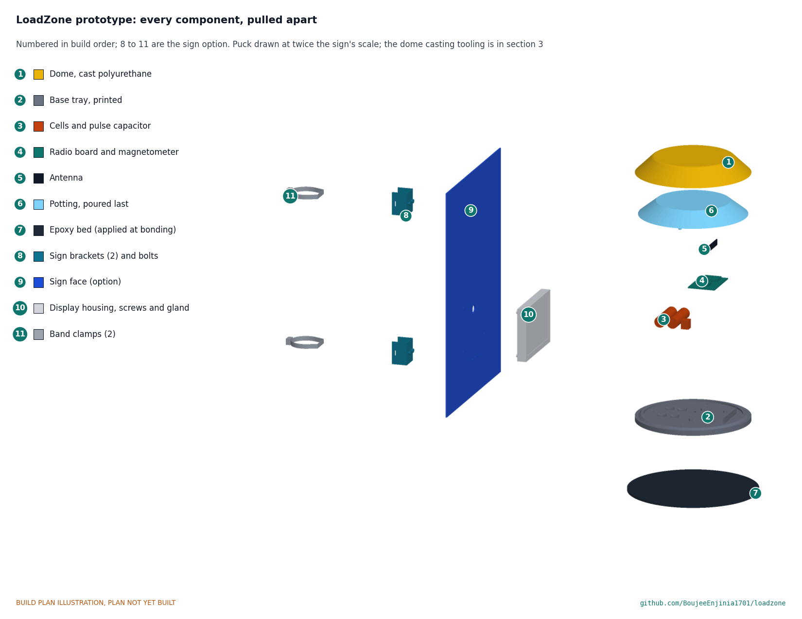

*Figure 1. Every component pulled apart and numbered in build order. The puck (1 to 7) is drawn at twice the scale of the sign option (8 to 11).*

The prototype is the two-slot bay kit: two LoadZone pucks, each bonded to a test slab in the workshop, and, as an option, one "Loading zone" sign with an e-paper display on a short length of pole. Each puck is a yellow polyurethane dome, cast in a home-made mould, sitting on a printed base tray that carries two primary lithium cells, a small radio board with a magnetometer, and a flexible antenna; the whole inside is then filled with potting resin through a hole in the tray, so the puck is solid and sealed for life. Figure 1 shows the 11 components in the order you make or fit them. Made in the workshop: the dome (with its printed mould master, silicone mould and printed core plug), the base tray, the radio board, the potting, and the two sign brackets; the sign face and the display housing are bought and drilled; everything else is bought and fitted. The work is 3D printing, casting polyurethane and silicone, soldering bought modules, pouring potting, and sawing and drilling aluminium channel and sign panel. The two-puck kit costs about USD 116 in parts from the bill of materials; the sign option is costed separately and runs from a host FieldNode built to the FieldNode build plan.

> **Safety:** Each puck holds two lithium thionyl chloride cells, which must never be charged, shorted, heated, crushed or opened: they can vent toxic, corrosive gas and burn. Polyurethane casting resins and potting contain isocyanates, and road-marker epoxy can sensitize skin: cast, pot and bond only with ventilation, gloves, eye protection and, for isocyanates, a suitable respirator. Bonding a puck to a real road is outside this plan and needs a permit, a trained crew and traffic management. Cut aluminium edges are sharp: deburr them and wear gloves.

## 2. What changed to make it buildable

The concept showed what LoadZone does; some of its parts could not be made, fitted or potted as drawn. Each change below keeps what the puck and the sign do, and all of them are recorded in decision record LDZ-DDR-003, open for Amish's review.

*Table 1. Changes from the concept.*

| Component | The concept had | The buildable design has | Why |
| --- | --- | --- | --- |
| Base | A flat disc with no joint to the dome and no way to pour the potting | A printed tray with a tapered locating ring, an 8 mm fill hole and four 4 mm vents; the dome's seam is sealed; the puck is potted upside down (Figures 7, 8 and 11) | The dome locates and seals, and air leaves through the vents as the potting rises |
| Parts inside the puck | Cells, board and antenna floating in the cavity | Cell cradles, board standoffs and an antenna rib printed on the tray (Figure 9) | Every part is held while it is wired, tested and potted |
| Cells and antenna | Cells 1.2 mm and antenna 1.9 mm from the dome wall | Cells moved 3 mm and the antenna 2 mm toward the centre: 2.5 mm and 3.8 mm clear | Room for the solder tabs and for the potting to flow |
| Dome | "A printed silicone mould", with no core | A printed master, a silicone mould cast in it and a printed core plug (Figures 2 to 5) | A dome with a cavity needs both an outer mould and a core |
| Radio board | No way to program or test it once potted | Programming pads, with programming and a bench test as a hold point before the dome goes on | The potted puck cannot be opened again |
| Sign mounting | Solid rings round the pole, arms only touching the sign | Aluminium channel brackets bolted to the sign, with stainless band clamps through slots in their flanges (Figures 13 to 15) | A closed ring cannot be fitted to a pole; a band clamp can |
| Display housing | A solid block on the sign with no fixing or cable path | A bought enclosure with a clear lid, screwed from behind the sign, with a cable gland through the sign face (Figure 19) | The housing is held and sealed and its cable runs behind the sign |

## 3. Making the components

Make and check each component before the step that needs it. Sizes are in millimetres. On the puck, "left" and "right" are as seen from above with the antenna rib on the right; positions are measured from the centre of the tray. On the sign, heights are measured up from the bottom edge of the sign face and sideways from its centre line. Workshop tolerance is 0.5 mm unless a step says otherwise; drawings do not carry tolerances before TRL 4.

### 3.1 Mould master

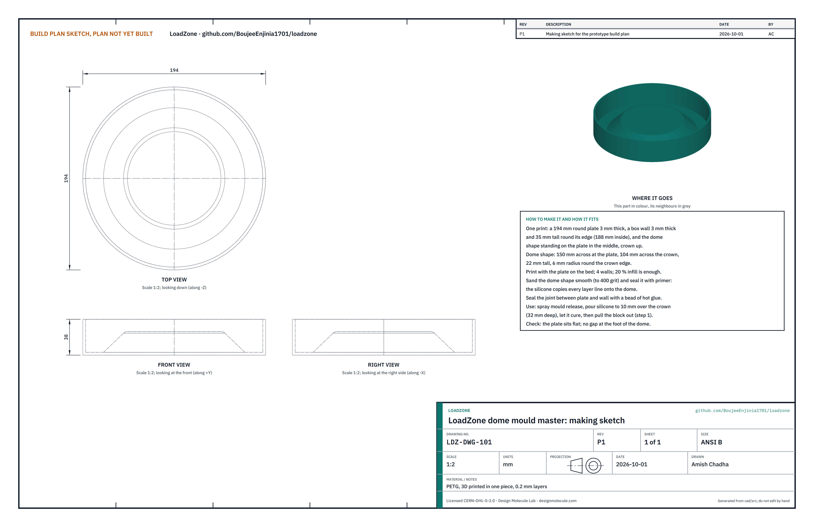

*Figure 2. Mould master making sketch (LDZ-DWG-101).*

**What it is and what it is made from.** A one-piece print that has the outside shape of the dome standing on a plate inside a round box; silicone is poured into it to make the mould. PETG, printed at 0.2 mm layers.

**How to make it.**

1. Print the plate (194 mm across, 3 mm thick) on the bed, with its box wall (3 mm thick, 35 mm tall, 188 mm inside) and the dome shape (150 mm across at the plate, 104 mm across the crown, 22 mm tall, 6 mm radius round the crown edge) in one piece. Four walls and 20 % infill are enough.
2. Sand the dome shape to 400 grit and seal it with a sanding primer; the silicone copies every layer line onto the dome.
3. Run a bead of hot glue round the inside foot of the box wall so silicone cannot leak through the print.

**How it fits the parts next to it.** The silicone fills the box to 10 mm over the crown (32 mm deep) and takes the dome's outside shape (step 1).

**Check before moving on.** The plate sits flat on a glass sheet; the dome shape has no gap at its foot.

### 3.2 Silicone mould

**What it is and what it is made from.** A block of addition-cure (platinum) silicone, 188 mm across and 32 mm tall, with the dome's outside shape as a cavity in one face. About 1 kg of mould rubber.

**How to make it.**

1. Spray the master with the silicone maker's release agent. Try a small patch of silicone on a scrap of the same primer first: some primers stop platinum silicone curing.
2. Mix the silicone by weight, degas it if you can, and pour it slowly into one corner of the box so it flows over the dome shape without trapping air. Fill to 10 mm over the crown.
3. Let it cure for the maker's full time, then pull the block out and turn it over: the cavity faces up (step 1, Figure 3).

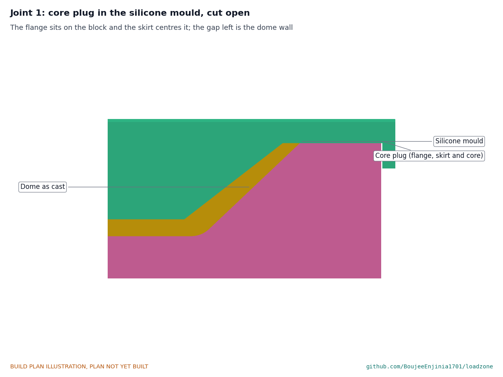

*Figure 3. The core plug's flange sits on the top of the block and its skirt centres it; the gap between the core and the cavity is the dome.*

**How it fits the parts next to it.** The core plug sits on its top face (Figure 3).

**Check before moving on.** The cavity is smooth and free of bubbles; the top face is flat.

### 3.3 Core plug

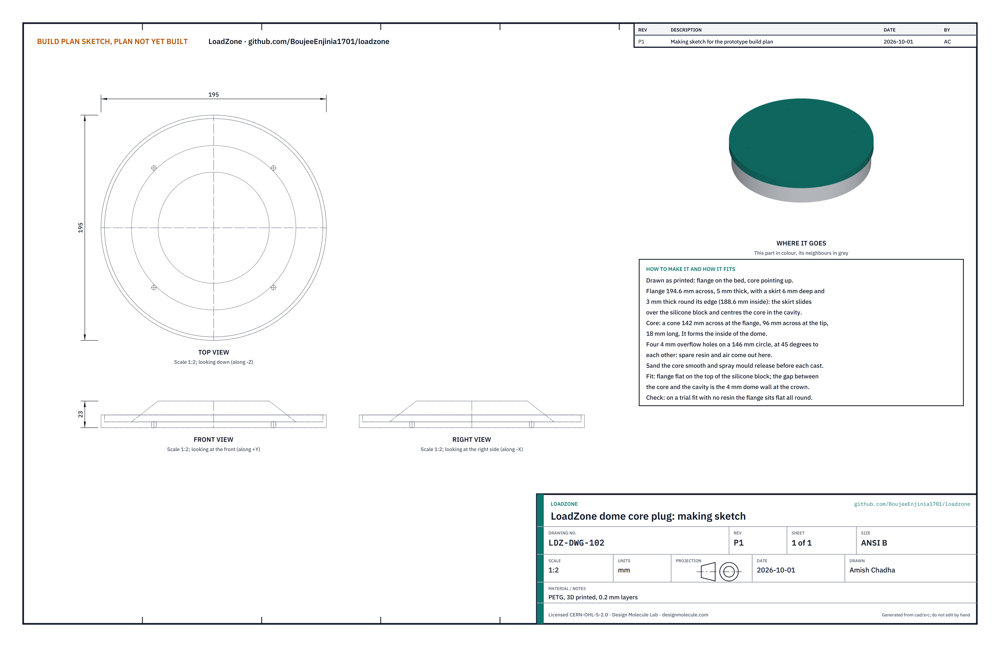

*Figure 4. Core plug making sketch (LDZ-DWG-102), drawn as printed.*

**What it is and what it is made from.** A printed lid for the mould whose cone forms the inside of the dome. PETG, printed flange down.

**How to make it.**

1. Print the flange (194.6 mm across, 5 mm thick) with its skirt (6 mm deep, 3 mm thick, 188.6 mm inside) round the edge and the cone (142 mm across at the flange, 96 mm across the tip, 18 mm long) in the middle.
2. Print or drill four 4 mm overflow holes through the flange on a 146 mm circle, at 90 degrees to each other.
3. Sand the cone smooth and seal it as in 3.1.

**How it fits the parts next to it.** The flange rests flat on the silicone block, the skirt slides over the block's outside with 0.3 mm to spare, and the cone hangs in the cavity with a 4 mm gap at the crown (Figure 3). The overflow holes sit over the rim of the dome, where spare resin and air come out.

**Check before moving on.** On a trial fit with no resin, the flange sits flat all round and the core does not touch the cavity anywhere.

### 3.4 Dome (make 2)

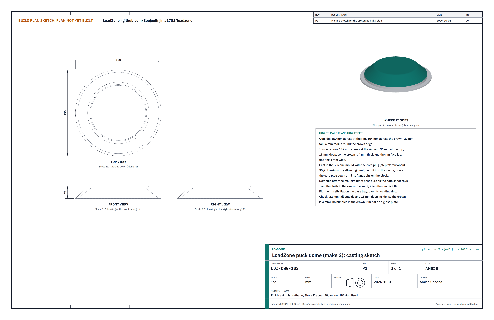

*Figure 5. Dome casting sketch (LDZ-DWG-103).*

**What it is and what it is made from.** The yellow dome that takes the wheel loads and keeps water out. Rigid casting polyurethane, about Shore D 80, with yellow pigment and a UV stabiliser.

**How to make it.**

1. Spray the cavity and the core with release agent and let it flash off.
2. Weigh out about 95 g of resin and hardener, add the pigment, and mix as the maker says. Degas if you can.
3. Pour the resin into the cavity, then press the core plug down slowly until its flange sits on the block all round (step 2). Spare resin rises through the overflow holes.
4. Leave it for the maker's demould time, lift off the core and flex the silicone to release the dome. Post-cure as the data sheet says.
5. Trim the flash at the rim with a sharp knife, keeping the rim face flat. Make the second dome the same way.

**How it fits the parts next to it.** The flat rim, 4 mm wide, sits on the base tray over its locating ring (Figure 8).

**Check before moving on.** The dome is 22 mm tall outside and 18 mm deep inside, so the crown is 4 mm thick; there are no bubbles in the crown; the rim lies flat on a glass sheet.

### 3.5 Base tray (make 2)

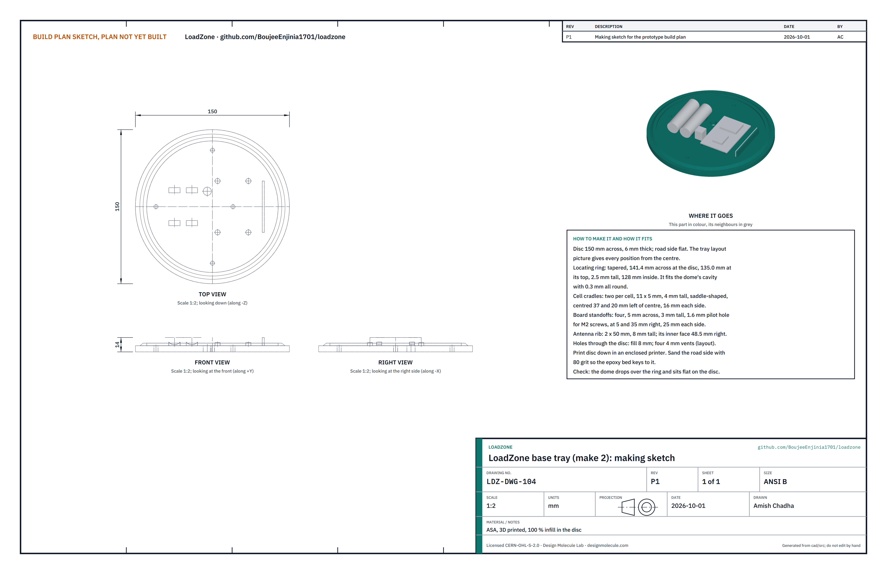

*Figure 6. Base tray making sketch (LDZ-DWG-104).*

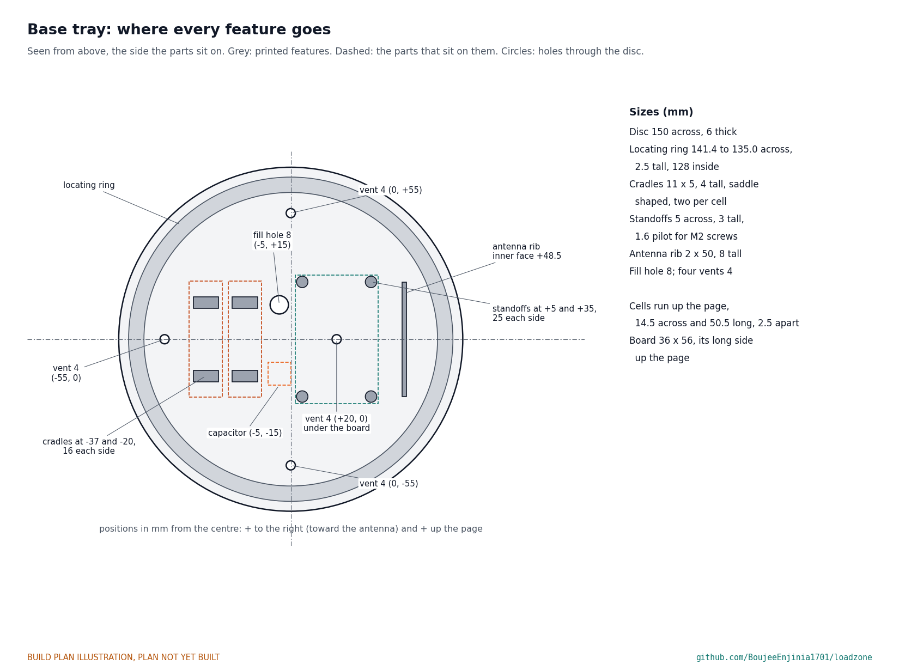

*Figure 7. Where every feature goes, seen from above, with the parts that sit on them dashed.*

**What it is and what it is made from.** The bottom of the puck: a disc that carries every part inside and closes the dome. ASA, printed in an enclosed printer, solid in the disc.

**How to make it.**

1. Print the disc (150 mm across, 6 mm thick) flat side down, with its features on top, as Figure 7 shows:
   - the locating ring, tapered, 141.4 mm across at the disc and 135.0 mm across its top, 2.5 mm tall, 128 mm inside;
   - two saddle-shaped cradles for each cell, 11 x 5 mm and 4 mm tall, centred 37 and 20 mm left of centre and 16 mm each side of it;
   - four board standoffs, 5 mm across and 3 mm tall with a 1.6 mm pilot hole, 5 and 35 mm right of centre and 25 mm each side;
   - the antenna rib, 2 x 50 mm and 8 mm tall, its inner face 48.5 mm right of centre;
   - the 8 mm fill hole, 5 mm left and 15 mm up from centre, and four 4 mm vents: one 20 mm right of centre (under the board), one 55 mm left, and two 55 mm up and down.
2. Sand the flat road side with 80 grit so the epoxy bed keys to it. Keep the holes clear.

**How it fits the parts next to it.** The dome drops over the locating ring with 0.3 mm all round and its rim sits flat on the disc:

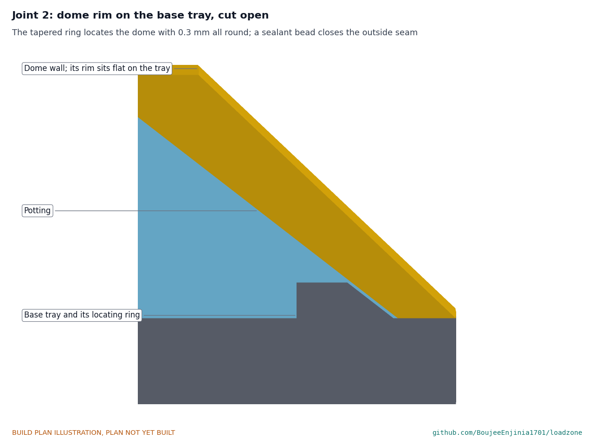

*Figure 8. The tapered ring centres the dome; the potting fills the inside up to the dome wall.*

**Check before moving on.** A dome drops over the ring and sits flat on the disc without rocking; a cell lies in its two cradles without rolling.

### 3.6 Electronics on the tray

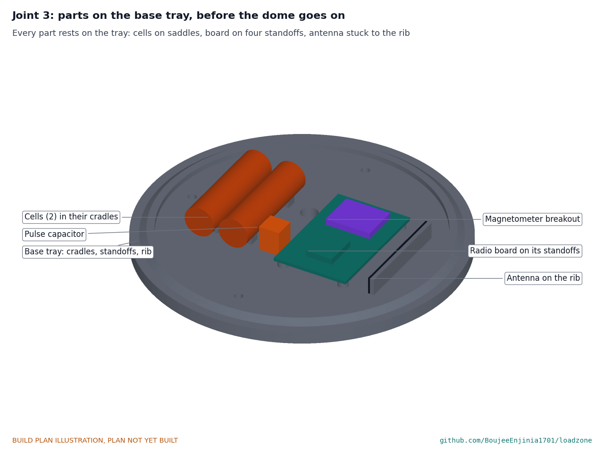

*Figure 9. Every part rests on the tray: cells on their saddles, the board on four standoffs, the antenna on the rib.*

**What it is and what it is made from.** The cells, pulse capacitor, radio board, magnetometer and antenna, all bought, wired together on the tray. The radio board is a 36 x 56 mm piece of prototyping board carrying the radio module, a 2 MB memory chip, one Schottky diode for each cell, a 0.5 A fuse and programming pads; the magnetometer breakout sits on top of it, flat, so its vertical sensing axis points up.

**How to make it.**

1. Build the radio board: solder the module, memory, diodes, fuse and pads to the prototyping board, and drill a 2.2 mm hole at each corner to match the standoffs (30 x 50 mm apart).
2. Fix the board to the four standoffs with M2 x 5 self-tapping screws. Stick the magnetometer breakout to the board with double-sided foam tape and wire it.
3. Stick the antenna to the inner face of the rib, its trace away from the board, and plug its lead into the module.
4. Stand the pulse capacitor in its place (5 mm left and 15 mm down from centre) with a dab of adhesive.
5. Wire the cells and capacitor as Figure 10 shows. Use cells with factory-welded solder tabs; never solder to the cell can. Lay each cell in its cradles with a dab of adhesive.

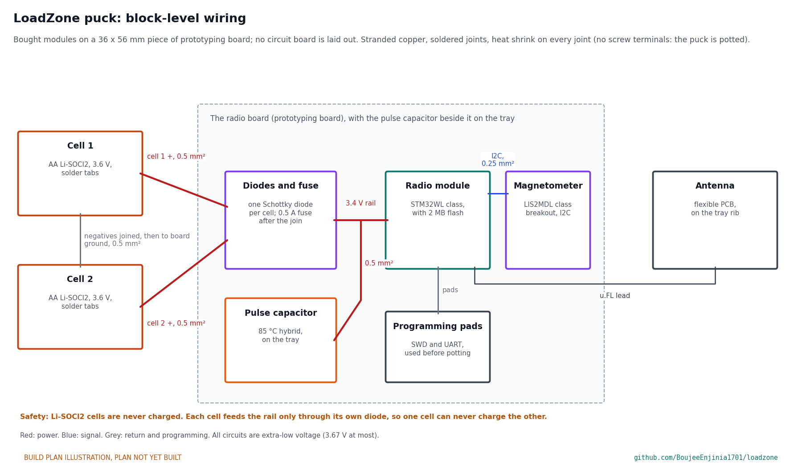

*Figure 10. Block-level wiring with wire sizes. No circuit board is laid out at this stage; bought modules on prototyping board stand in for it.*

Wire it like this, with stranded copper, soldered joints and heat shrink on every joint:

1. Each cell's positive tab to its own Schottky diode on the board: 0.5 mm² (20 AWG). The two diodes join after their cathodes, then pass through the 0.5 A fuse to the supply rail.
2. Both negative tabs joined together and to the board's ground: 0.5 mm².
3. The pulse capacitor across the supply rail and ground, as close to the module as the leads allow: 0.5 mm².
4. The magnetometer to the module's I2C pins and to the supply rail: 0.25 mm² (24 AWG).
5. The antenna's u.FL lead to the module, routed away from the cell leads.
6. The programming pads to the module's SWD and UART pins.

**How it fits the parts next to it.** Every part stands on the tray and nothing touches the dome: the cells sit 2.5 mm inside the dome wall, the antenna 3.8 mm, and the board's top 10 mm below the dome. The board's 3 mm gap and the vent under it let potting flow under the board.

**Check before moving on.** This is the hold point of step 3: the board is programmed through its pads; a bench uplink reaches a gateway; with both cells fitted, the supply rail reads about 3.4 V; the sleep current is a few microamps (section 5). Then cut the programming wires off at the pads.

### 3.7 Potting

**What it is and what it is made from.** About 175 cm³ of semi-rigid polyurethane potting that fills every gap inside the dome, carries wheel loads from the crown to the tray, and seals the electronics. Choose a low-exotherm grade rated for electronics.

**How to make it.** Steps 4 and 5: dome on, seam sealed, puck upside down, potting poured through the fill hole until it shows at every vent, topped up, cured and scraped flush.

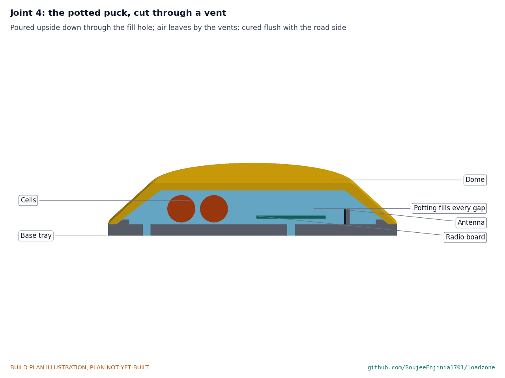

*Figure 11. The potting fills the dome around the cells, board and antenna and fills the fill hole and vents flush with the road side.*

**How it fits the parts next to it.** It bonds to the inside of the dome, the tray and every part, and finishes flush with the road side of the tray.

**Check before moving on.** Resin stands in every vent; after cure, the road side is flat and a tap round the dome sounds the same everywhere (no hollow spots).

### 3.8 Epoxy bed and test slab

**What it is and what it is made from.** The bond between puck and road: a 3 mm bed of two-part road-marker epoxy, 170 mm across, on a test slab of asphalt or a concrete paver at least 300 mm square.

**How to make it.** Step 6: clean and dry the slab, spread the mixed epoxy, press the puck in with a slight twist, smooth the squeeze-out.

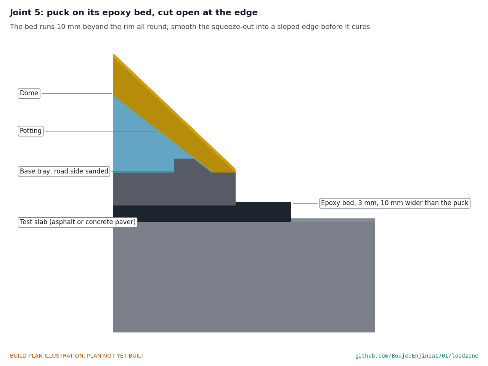

*Figure 12. The bed runs 10 mm beyond the rim all round and is smoothed into a sloped edge.*

**How it fits the parts next to it.** The bed bonds the sanded road side of the tray to the slab; the fill and vent holes are under it.

**Check before moving on.** The bed is even all round, with no gap under the rim edge; after cure the puck does not move under a hard push by hand.

### 3.9 Sign brackets (make 2; sign option)

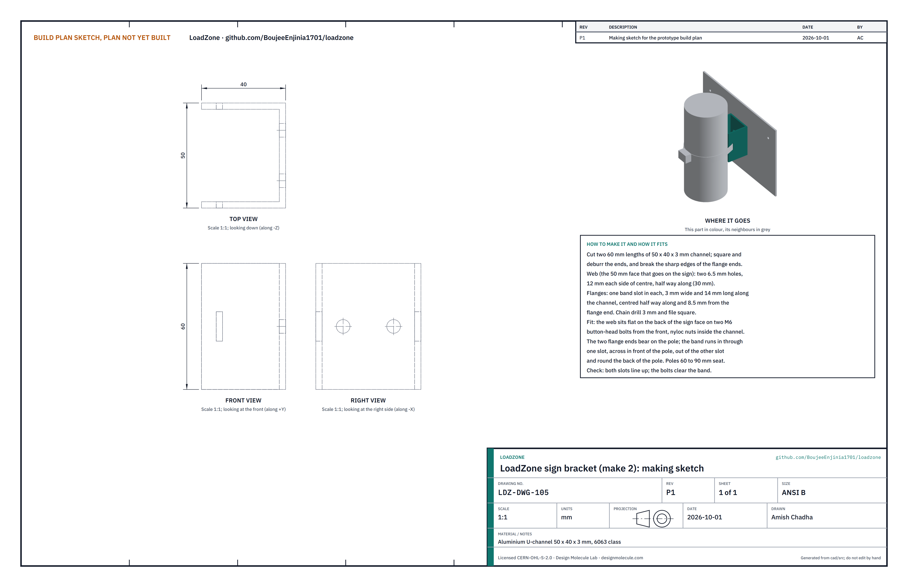

*Figure 13. Sign bracket making sketch (LDZ-DWG-105).*

**What it is and what it is made from.** A short length of channel that bolts to the back of the sign and bears on the pole, with a band clamp through it. Aluminium U-channel 50 x 40 x 3 mm, 6063 class.

**How to make it.**

1. Cut two 60 mm lengths; square and deburr the ends and break the sharp edges of the flange ends, which bear on the pole.
2. In the web (the 50 mm face), drill two 6.5 mm holes, 12 mm each side of centre and half way along.
3. In each flange, cut a band slot 3 mm wide and 14 mm long along the channel, centred half way along and 8.5 mm from the flange end: chain drill 3 mm and file square. Drill the two brackets clamped together so the slots line up.

**How it fits the parts next to it.**

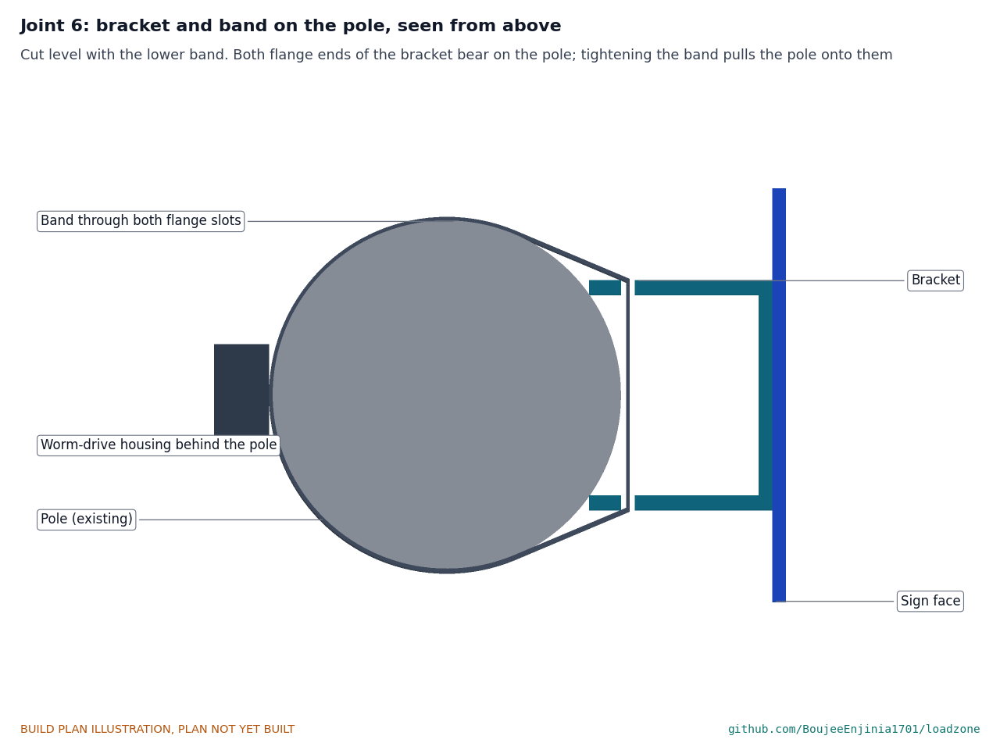

*Figure 14. Both flange ends bear on the pole; the band runs in through one slot, across in front of the pole, out of the other and round the back of the pole.*

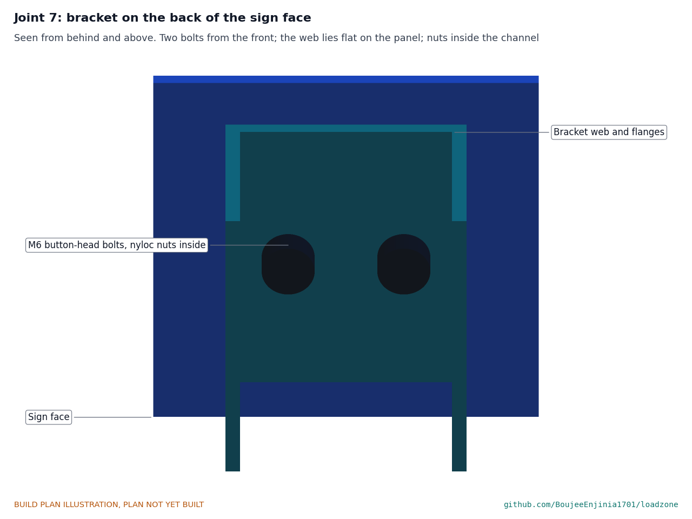

*Figure 15. The web lies flat on the back of the sign, held by two M6 button-head bolts from the printed side with nyloc nuts inside the channel.*

The web lies flat on the back of the sign face, 100 mm from its top or bottom edge. The flange ends stand 40 mm off the sign and bear on the pole; the sign face ends up 33 mm from the pole's surface. Any pole from 60 to 90 mm seats on both flange ends. When the band is tightened, the worm-drive housing sits behind the pole.

**Check before moving on.** Both slots line up; with the bolts fitted, a band passes through both slots without touching a nut.

### 3.10 Sign face (sign option)

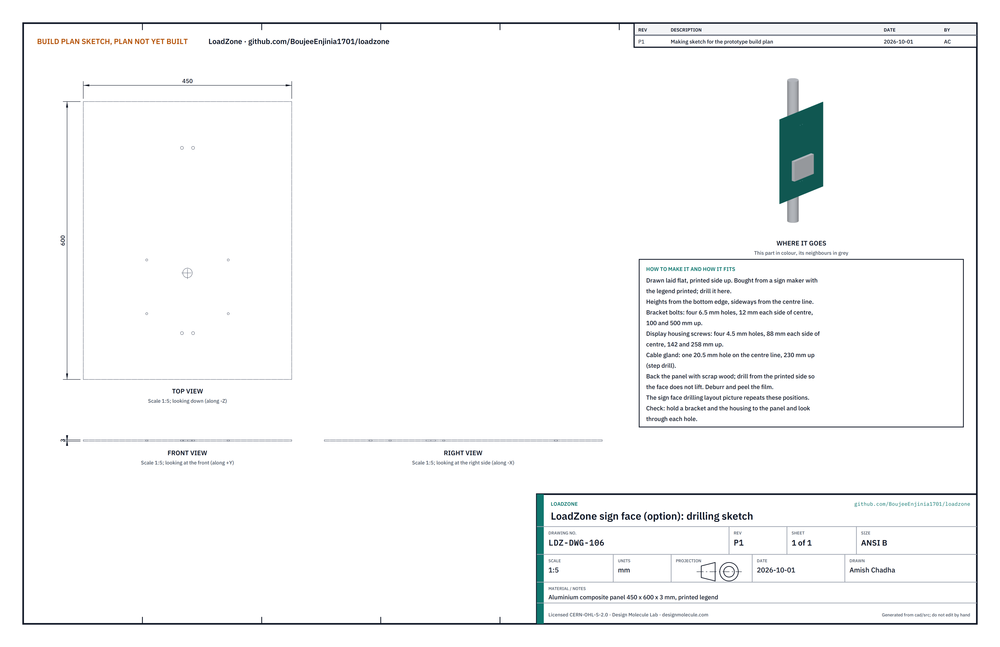

*Figure 16. Sign face drilling sketch (LDZ-DWG-106), drawn laid flat.*

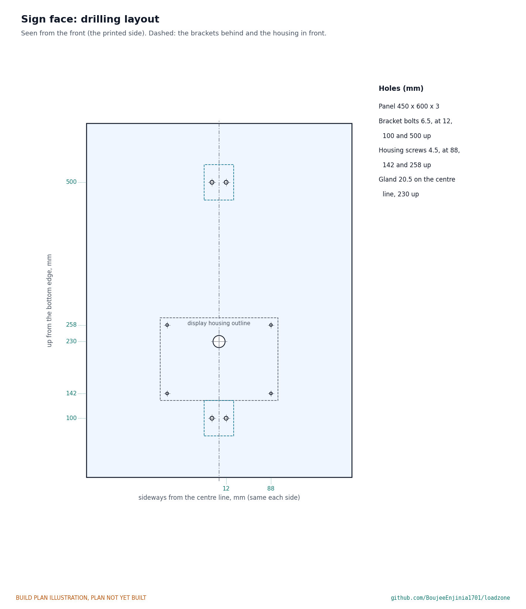

*Figure 17. Every hole on the sign face, seen from the printed side.*

**What it is and what it is made from.** The "Loading zone" sign: an aluminium composite panel, 450 x 600 x 3 mm, bought from a sign maker with the legend printed. For the workshop prototype the legend is a placeholder; a sign for a street gets a legend drawn to the trial city's sign rules (in the US, the MUTCD) and approved by the city traffic engineer before it is mounted.

**How to make it.**

1. Lay the panel printed side up on scrap wood. Mark the holes from Figure 17.
2. Bracket bolts: four 6.5 mm holes, 12 mm each side of centre, 100 and 500 mm up.
3. Housing screws: four 4.5 mm holes, 88 mm each side of centre, 142 and 258 mm up.
4. Cable gland: one 20.5 mm hole on the centre line, 230 mm up, with a step drill.
5. Drill from the printed side so the face does not lift; deburr and peel the film.

**How it fits the parts next to it.** The brackets bolt to its back (Figure 15) and the display housing screws to its front (Figure 19).

**Check before moving on.** Hold a bracket and the housing to the panel and look through each hole.

### 3.11 Display housing (sign option)

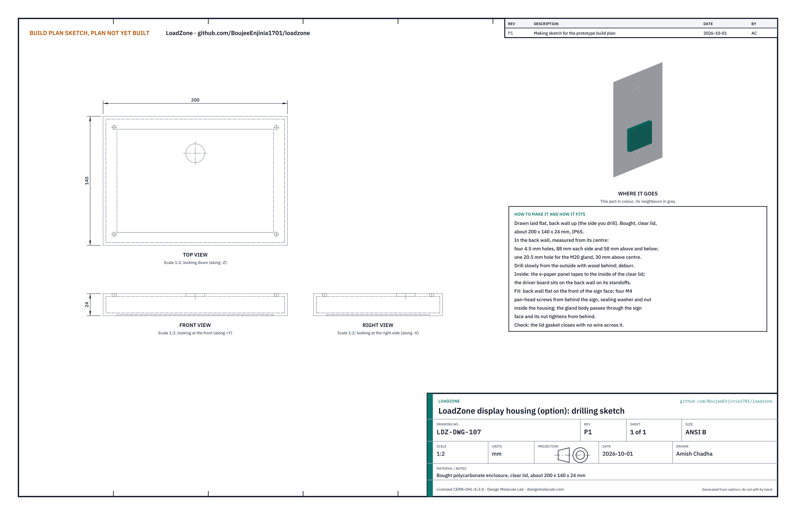

*Figure 18. Display housing drilling sketch (LDZ-DWG-107), drawn back wall up.*

**What it is and what it is made from.** A bought polycarbonate enclosure with a clear lid, about 200 x 140 x 24 mm, rated IP65, holding a 7.5 inch e-paper panel and its driver board.

**How to make it.**

1. In the back wall, drill four 4.5 mm holes, 88 mm each side of centre and 58 mm above and below it, and one 20.5 mm hole for the gland 30 mm above centre. Drill slowly from the outside with wood behind, and deburr.
2. Tape the e-paper panel to the inside of the clear lid, display side out, and fix the driver board to the back wall on its standoffs.
3. Fit the M20 gland body through the back wall from inside, with its lock nut inside, and pass the cable from the host FieldNode through it to the driver board.

**How it fits the parts next to it.**

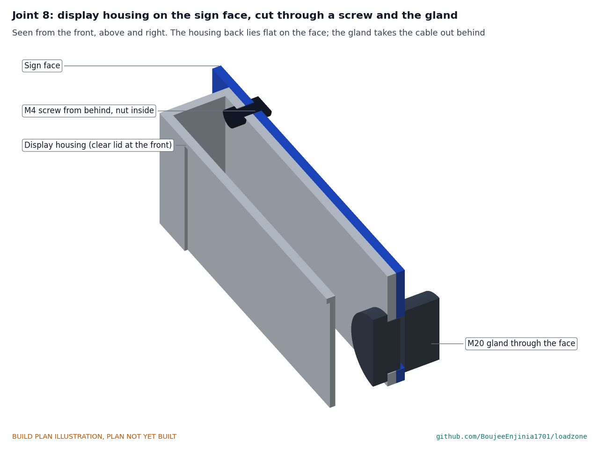

*Figure 19. The housing back lies flat on the sign face; four M4 screws come from behind the sign; the gland passes through the face so the cable runs behind the sign.*

**Check before moving on.** The lid closes on its gasket with no wire across it; the gland nut is tight.

### 3.12 Bought components

Buy to specification, not brand. Line numbers are those of the bill of materials.

- **Magnetometer (line 2).** 3-axis, 16-bit, LIS2MDL class, I2C, on a breakout about 22 x 18 mm.
- **Radio module (line 3).** STM32WL-class LoRaWAN module (RAK3172 or Wio-E5 class), with a 2 MB SPI memory chip, two Schottky diodes, a 0.5 A fuse and a 36 x 56 mm piece of prototyping board.
- **Antenna (line 4).** Flexible printed antenna for 915 MHz (the US915 band, the default), adhesive backed, with a u.FL lead.
- **Cells and capacitor (line 5).** Two AA-size lithium thionyl chloride bobbin cells (ER14505 class, about 2.6 Ah) with factory-welded solder tabs, from a maker that publishes a data sheet; one hybrid pulse capacitor rated to 85 °C, at least 31 mF equivalent.
- **Potting (line 6).** Semi-rigid polyurethane potting for electronics, low exotherm, about 175 cm³ per puck; PETG and ASA filament for the prints.
- **Epoxy (line 7).** Two-part road-marker epoxy for raised pavement markers, about 70 cm³ per puck.
- **Sign face (line 8).** Aluminium composite panel 450 x 600 x 3 mm with the printed legend.
- **Display (line 9).** 7.5 inch e-paper panel, 800 x 480, with a driver board that takes commands from the host FieldNode; polycarbonate enclosure with a clear lid; four M4 x 12 pan-head screws with sealing washers and nuts; one M20 cable gland.
- **Brackets (line 10).** 60 mm lengths of 50 x 40 x 3 mm aluminium channel, two 12 mm stainless worm-drive band clamps for 60 to 90 mm poles, four M6 x 16 stainless button-head bolts with nyloc nuts.
- **Hardware and consumables (line 12).** Wire, heat shrink, M2 x 5 self-tapping screws, polyurethane sealant, mould release, cleaning solvent.
- **Casting tooling (line 13).** PETG filament for the master and core plug, about 1 kg of addition-cure silicone mould rubber, rigid casting polyurethane with yellow pigment and UV stabiliser (line 1).

## 4. Putting it together

In each picture the parts already fitted are grey and the part being fitted is in colour, with an arrow showing the way it goes in. Steps 1 and 2 make the dome (sections 3.2 to 3.4); steps 3 to 6 build one puck, so do them twice; steps 7 to 9 build the sign option.

### Step 1: make the silicone mould

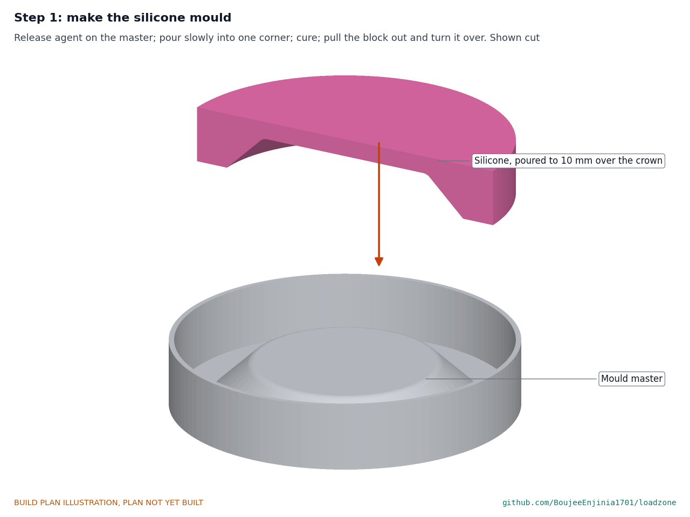

Release agent on the master; pour the silicone slowly into one corner until it stands 10 mm over the crown; cure; pull the block out and turn it over.

### Step 2: cast the dome

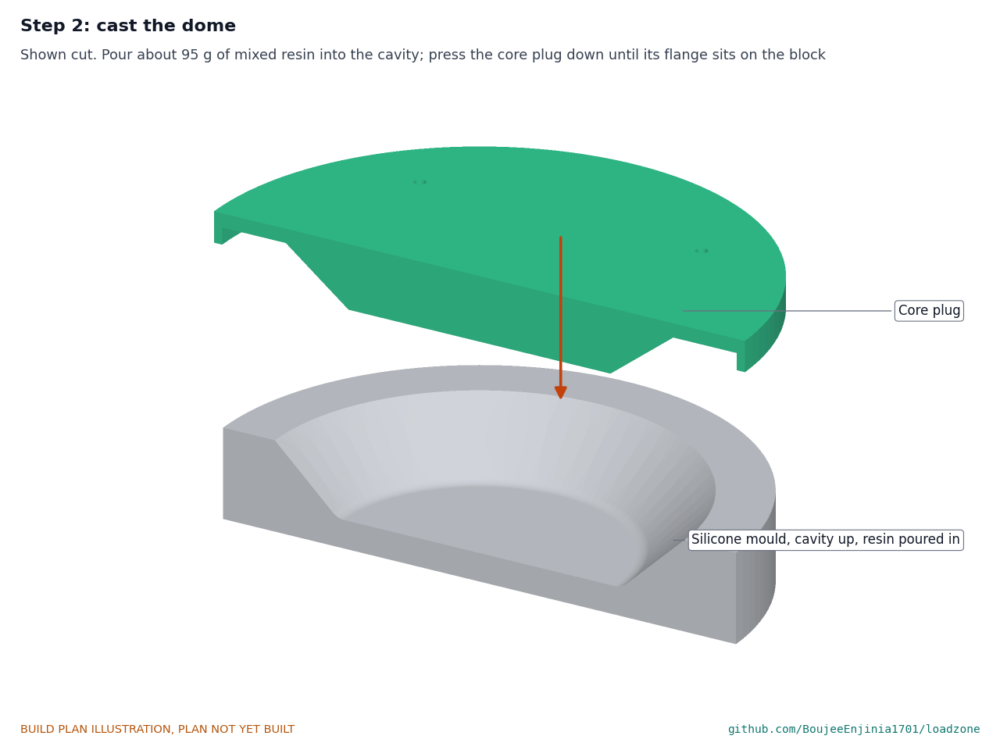

About 95 g of mixed resin into the cavity; press the core plug down until its flange sits on the block; demould, post-cure and trim (section 3.4).

### Step 3: electronics onto the base tray

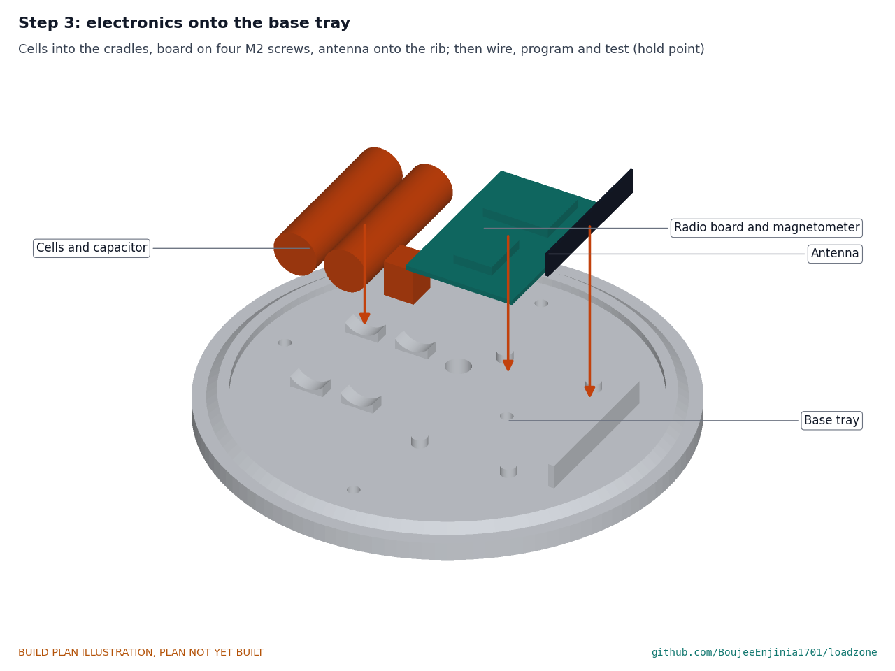

Cells into their cradles, board on four M2 screws, antenna onto the rib, capacitor in place; wire as Figure 10. **Hold point:** the board is programmed and passes the bench checks of section 5 (rail voltage, sleep current, a received uplink) before the dome goes on. Nothing can be changed after step 5.

### Step 4: dome onto the base tray

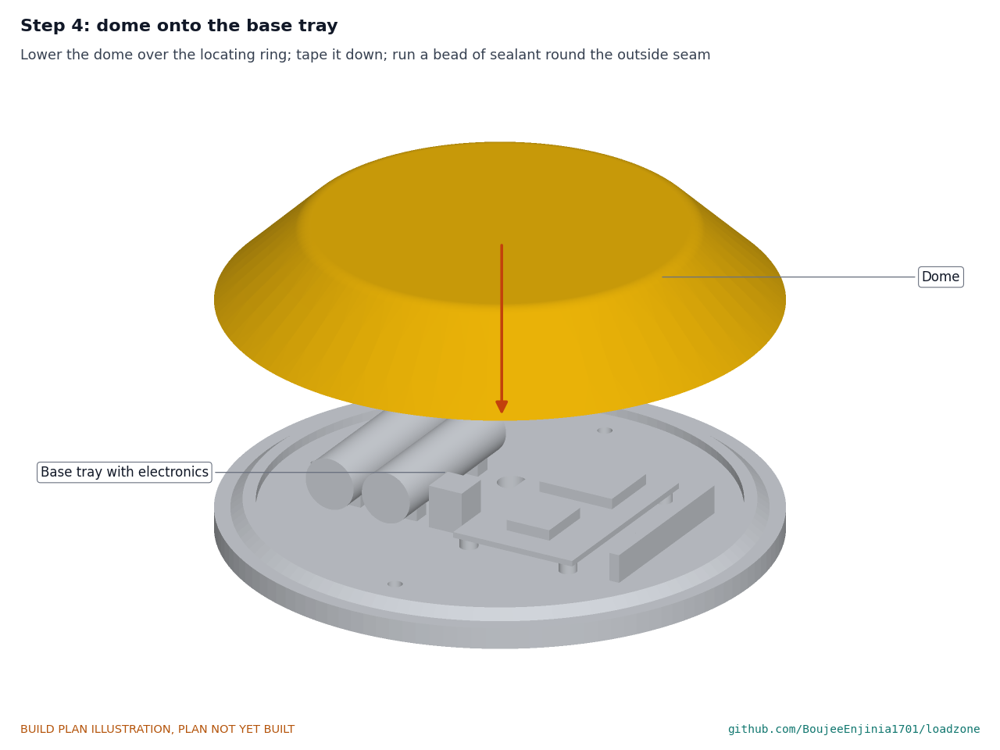

Lower the dome over the locating ring until the rim sits flat on the disc. Tape it down with two strips across the crown, and run a bead of polyurethane sealant round the outside of the seam. Let the sealant skin over.

### Step 5: pot the puck, upside down

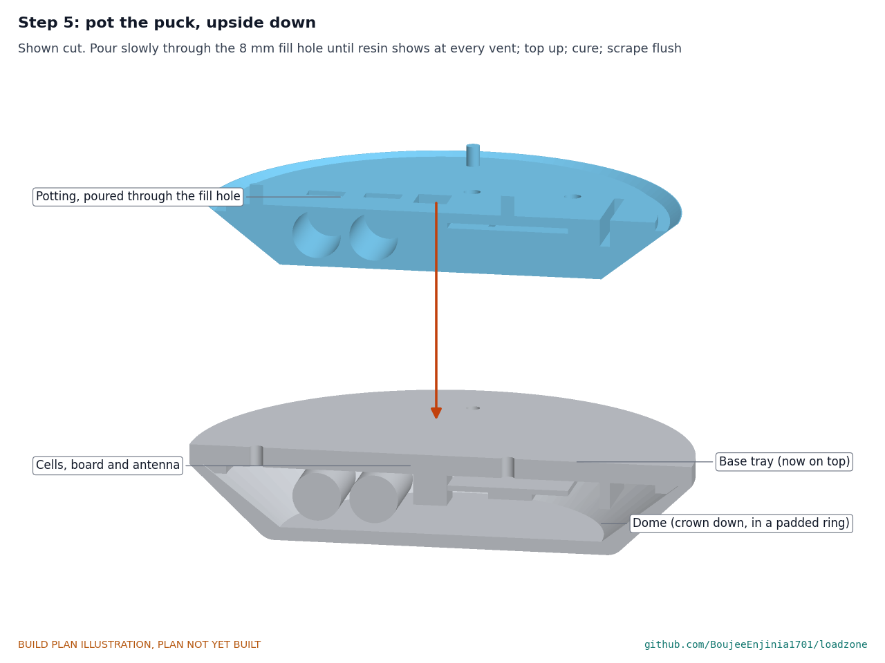

Set the puck crown down in a padded ring so the tray is level and on top. Pour the mixed potting slowly through the fill hole until it stands in every vent; wait ten minutes for air to rise, and top up. Cure at room temperature as the maker says, then scrape the fill hole and vents flush with the road side. **Hold point:** safety stop S4 in section 6.

### Step 6: bond the puck to a test slab

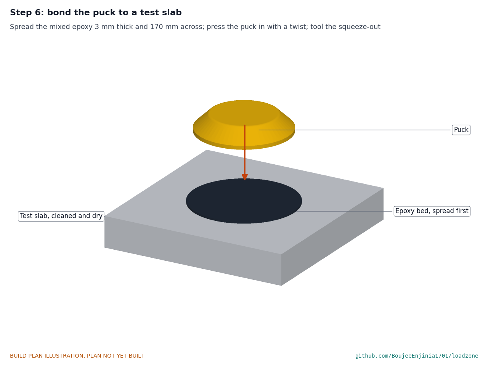

Clean and dry the slab. Spread the mixed epoxy 3 mm thick and 170 mm across, press the puck in with a slight twist until the bed squeezes out 10 mm all round, and smooth the edge into a slope. Leave it to cure for the maker's full time before any load.

### Step 7: brackets onto the back of the sign

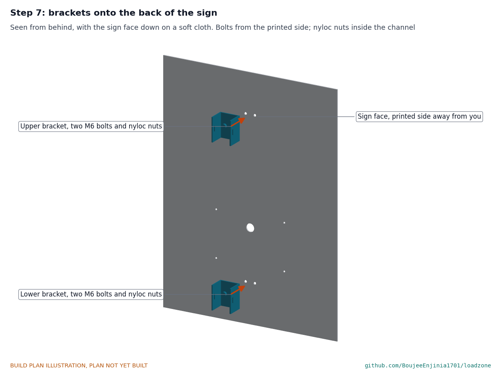

Sign face down on a soft cloth. Each bracket on two M6 button-head bolts from the printed side, nyloc nuts inside the channel, flanges pointing away from the sign. Tighten firmly without crushing the panel.

### Step 8: display housing onto the sign face

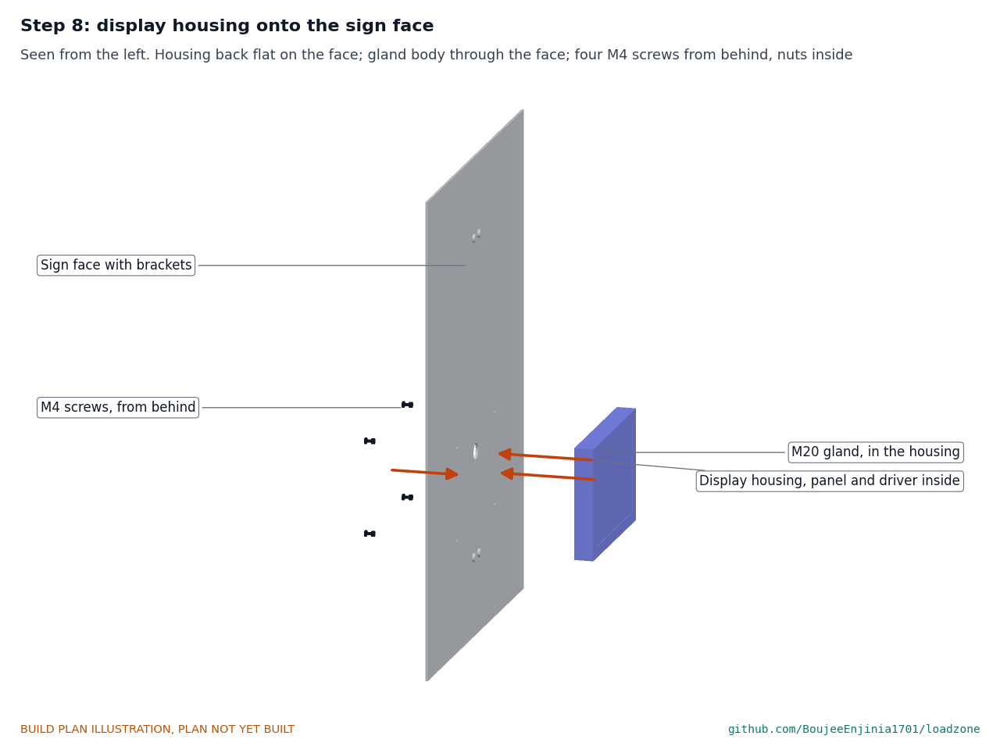

Panel and driver already fitted (section 3.11). Hold the housing's back flat on the printed face with the gland body through the 20.5 mm hole; four M4 screws from behind the sign with sealing washers and nuts inside the housing; tighten the gland nut behind the sign.

### Step 9: sign onto the pole stub

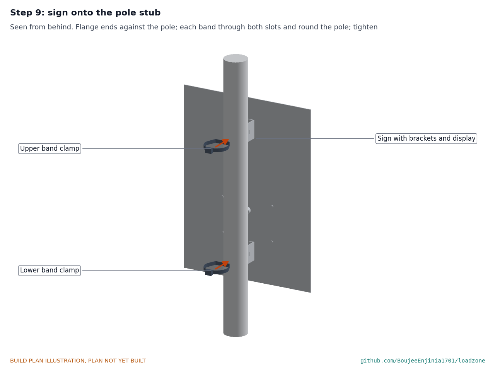

Seen from behind. Clamp a 1 m length of 76 mm pole upright in a stand. Hold the sign with both flange ends of each bracket against the pole; pass each band through both slots of its bracket and round the back of the pole, with the worm-drive housing behind the pole; tighten both bands. Run the display cable down behind the sign to the host FieldNode's sensor port, which is built to the FieldNode build plan. **Hold point:** safety stop S7 in section 6.

## 5. First checks

These are the checks a TRL 4 test report would record; this plan only lists them. Requirement numbers are those of LDZ-REQ-001.

*Table 2. First checks.*

| Check | Requirement | How | Pass when |
| --- | --- | --- | --- |
| Diodes block back-feed | Safety, R3 | Before the second cell goes in: one cell fitted, measure from the rail to the empty cell's tab | No voltage at the empty tab beyond leakage |
| Supply rail and sleep current | R3 | Bench, before the dome: rail voltage; current in sleep with a meter on its microamp range | About 3.4 V; sleep current near 6 µA |
| Magnetometer sees steel | R1 | Bench: move a steel plate about 1 kg over the board at 300 mm and away again | The reading changes by well over the 3 µT threshold and returns |
| Report time | R2 | Bench, puck near a gateway: change state with the steel plate; time to the state at the server | 60 s or less |
| Airtime at SF9 | R5 | Gateway log of one uplink | About 206 ms on air for the 11-byte payload |
| Only state and health leave the puck | R9 | Decode an uplink at the server | State, time since change, confidence, voltage, temperature, nothing else |
| Potting complete | R8 | After cure: vents full, tap test round the dome | No hollow spot; resin flush at every hole |
| Height and edge | R7 | Measure the bonded puck on the slab | 35 mm or less above the slab; no sharp edge |
| Bond by hand | R6, R14 | After cure, push the puck hard sideways by hand; time the bonding of the second puck | No movement; bonding takes 15 min or less for two people |
| Link from under a vehicle | R4 | Park a van over a bonded puck on its slab outdoors, gateway 300 m away | Uplinks received at SF9 or faster |
| Sign legibility | R11 | By day, show a two-digit count; read it from 25 m | Digits readable at 25 m |
| Sign power | R12 | Measure the sign's average draw from the host FieldNode over a day | Well under the FieldNode's 100 mW allowance (about 18 mW expected) |
| Sign on the pole | R11 | Push the sign's corners by hand on the pole stub | Nothing turns or slips at the bands |

## 6. Safety stops

Stop at each point. Carry on only when everything listed is true.

- **S1. Before the cells come into the workshop.** Cells from a maker with a data sheet, with factory-welded solder tabs, at about 3.6 V each with no dents, leaks or swelling. A fireproof place to store them, away from metal tools. Never charge, short, heat, crush or open a lithium thionyl chloride cell.
- **S2. Before the second cell is wired.** The diodes and the fuse are fitted and their direction checked with a meter, so neither cell can ever charge the other. Solder only to the tabs, quickly, never to the can.
- **S3. Before any casting, potting or bonding.** Ventilated space; nitrile gloves, eye protection and, for polyurethane resins and potting, a respirator rated for isocyanates; each maker's safety data sheet read; spills cleaned with the solvent the data sheet names.
- **S4. Before potting over live cells.** The bench checks of section 5 pass; the potting is a low-exotherm grade and the data sheet's peak temperature for about 175 cm³ is well below the cells' rating; pour at room temperature, never in a heated oven.
- **S5. Before bonding with hot-applied epoxy (if that grade is used).** Burn protection: heat-resistant gloves, long sleeves, and the heater on a stable surface.
- **S6. Before any puck goes on a real road (outside this plan).** A road authority permit, a trained crew, the traffic management that local rules require, high-visibility clothing; never from a live lane; away from bike lanes and crossings.
- **S7. Before the sign goes on the pole stub.** Sign and bracket edges deburred; band tails cut and capped; the stub clamped so it cannot tip under the sign; hands clear when tightening the bands.
- **S8. Before any street pole installation (outside this plan).** Work from a stable platform with a second person; clear of overhead power lines; the pole owner's permission for the added wind load.
- **S9. At end of life.** Spent pucks and cells go to hazardous-waste recycling as primary lithium cells; never cut a puck open.

## 7. Tools, skills and workspace

**Tools.** Enclosed 3D printer with a bed of at least 200 x 200 mm that prints ASA and PETG; digital scale reading 0.1 g; mixing cups, sticks and a timer; vacuum chamber for degassing (useful, not essential); sandpaper to 400 grit; sharp trimming knife; soldering iron with a fine tip; wire strippers and heat-shrink gun; multimeter with a microamp range; a debug programmer for the radio module (ST-LINK class) and access to a LoRaWAN gateway and network server; hacksaw with a 24 teeth per inch blade; bench drill or drill in a stand; drills 2 to 6.5 mm and a step drill to 22 mm; flat and needle files; scriber, square, steel rule and calipers; screwdriver for the band clamps; pole stand or bench clamp for a 1 m pole.

**Skills.** No certified trade is needed. Two-part resin casting and mould making, through-hole soldering, safe handling of primary lithium cells, flashing firmware with a debug programmer, and basic metalwork (marking out, sawing, drilling, filing). All circuits are extra-low voltage, 3.67 V at most in the puck; the sign runs from the host FieldNode. No mains wiring is part of this build.

**Workspace.** A bench about 1.2 x 0.6 m; a ventilated corner for casting, potting and bonding, kept apart from the electronics bench; a fireproof storage place for the cells; a place to leave castings and bonds curing undisturbed for a day.

**Personal protective equipment.** Safety glasses; nitrile gloves for resins and epoxy; a respirator rated for isocyanates when mixing and pouring polyurethane; cut-resistant gloves for aluminium; no gloves near a turning drill.

## 8. Where the numbers come from

- Model and constructability checks: `cad/src/model.py` (`python cad/src/model.py --check`, 92 checks); STEP and STL exports in `cad/step/` and `cad/stl/`.
- Pictures: `cad/src/build_plan_media.py`, using `.kit/build_views.py`; written to `docs/05-build-plan/` and `cad/drawings/LDZ-DWG-101` to `LDZ-DWG-107`.
- General arrangement: `cad/drawings/LDZ-DWG-001.pdf`, Rev P3.
- Calculations: `docs/04-calcs/01-sizing.md` (LDZ-CAL-001 v0.3) and `docs/04-calcs/sizing.py`; mass [G2], loads [F1] to [F4], link [D2], [D3], energy [B1] to [B5], cost [I1].
- Bill of materials: `bom/bom.csv` and `bom/bom-notes.md`.
- Decisions: `docs/decisions/0003-design-for-construction.md` (LDZ-DDR-003), with LDZ-DDR-001 and LDZ-DDR-002; open items in `docs/06-design-decisions.md` (LDZ-DEC-001).
- Requirements: `docs/03-requirements.md` (LDZ-REQ-001 v0.5).
